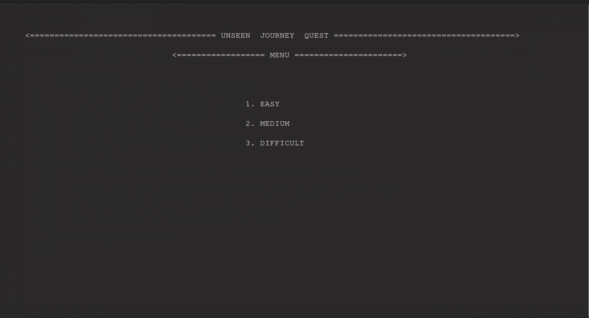
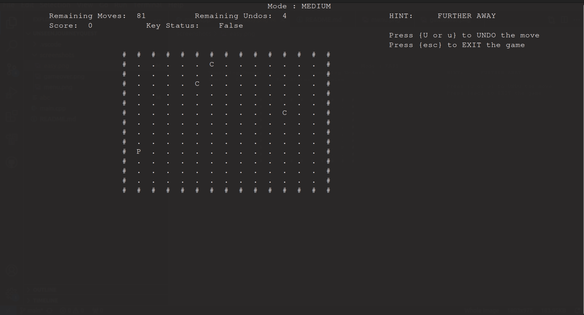
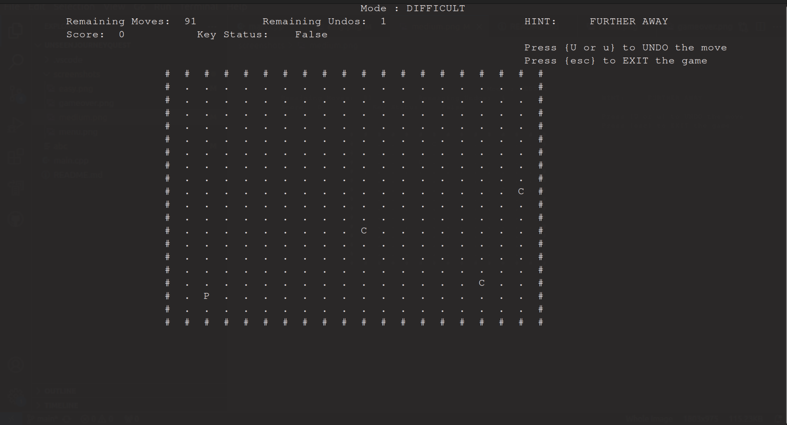
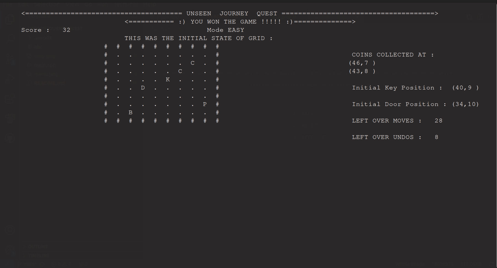

## UnseenJourneyQuest

# Description
    Unseen Journey Quest is an awesome game.
# Introduction
    "Trapped in a dark maze, you can only see the ground beneath your feet. Somewhere in
    the shadows, a hidden key unlocks the way out, but you can’t see it, and you don’t know
    where it is. You can sense when you’re moving closer to the key, guiding your steps
    through the darkness."
# Key Features

    Built with ncurses using cpp

    There are three modes : EASY , MEDIUM , DIFFICULT. For each mode the size of grid , number of moves and the undos are set according to distance between the player and the key.
    The Easy mode has 10*10 grid 
    The Medium Mode has 15*15 grid
    THe Difficult Mode has 20*20 grid
    The player poisition is visible and generated randomly everytime.You can move the player inside the grid.
    There is an Undo feature as well.
    Some Bombs are invisible and are generated randomly. Hitting the bomb results in loss of game.
    The Coins will be regenerated randomly after every 15 seconds and previous one would disappear.
    There is a hint feature that tells whether we are moving closer or further away from the key and when the key is found it tells about the door.

# Instructions
    To select the mode : Press {1 for EASY MODE , 2 for MEDIUM MODE and 3 for DIFFICULT MODE}
    Use the keyboard arrow keys to move the player
    To undo the move press{ u or U}
    The collection of coins result in addition of score 2 points and addition of one undo.
    Be aware of a hidden bomb
    Keep in view the hint to reach the key and door

# Installation
    You must have ncurses installed on mac/ubuntu and pdcurses on windows

    Download the project from https://github.com/hamdashahid/UnseenJourneyQuest.git
    Open a terminal in this folder
    Run the command  { " g++ -o abc main.cpp -lncurses "} 
    After compilation run ./abc to run the compiled game

## Some Sample Screen Shots
    
    
    
    
    
    
## Copyright    

© 2024 Hamda Shahid. All rights reserved.

This project cannot be copied, modified, or distributed without permission from the author.
