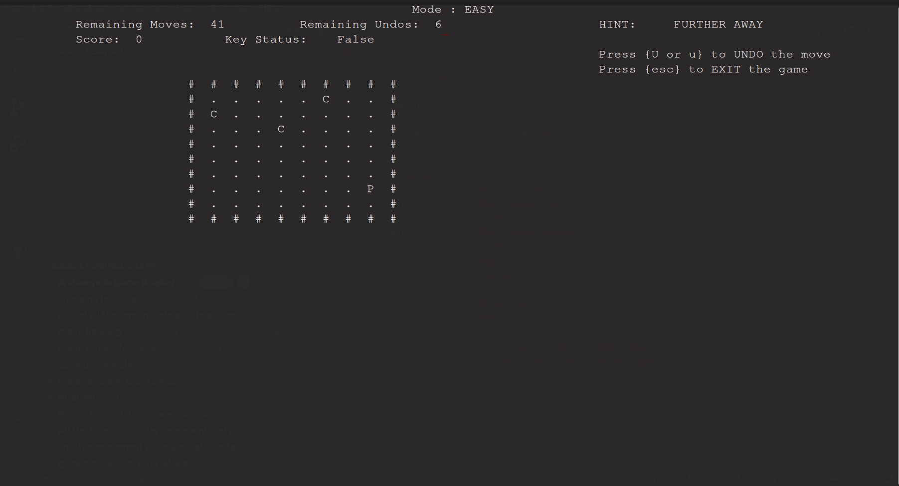

# UnseenJourneyQuest

## Description
Unseen Journey Quest is an awesome game.

## Introduction
*"Trapped in a dark maze, you can only see the ground beneath your feet. Somewhere in the shadows, a hidden key unlocks the way out, but you can’t see it, and you don’t know where it is. You can sense when you’re moving closer to the key, guiding your steps through the darkness."*

## Key Features

- **Built with ncurses using C++**
- **Three difficulty modes**:
  - **Easy Mode**: 10x10 grid
  - **Medium Mode**: 15x15 grid
  - **Difficult Mode**: 20x20 grid
- **Random Player Position**: The player’s position is visible and generated randomly every time. You can move the player inside the grid.
- **Undo Feature**: Players can undo moves.
- **Invisible Bombs**: Bombs are generated randomly, and hitting a bomb results in losing the game.
- **Random Coin Generation**: Coins are regenerated randomly every 15 seconds, and the previous coin disappears.
- **Hints**: A hint feature informs whether you’re moving closer or further from the key, and once the key is found, it guides you to the door.

## Instructions

- **To Select a Mode**: 
  - Press `1` for EASY MODE
  - Press `2` for MEDIUM MODE
  - Press `3` for DIFFICULT MODE
- **Movement**: Use the arrow keys to move the player.
- **Undo**: Press `u` or `U` to undo the last move.
- **Coins**: Collecting coins adds 2 points to your score and one undo.
- **Bombs**: Be aware of hidden bombs.
- **Hints**: Use hints to find the key and door.

## Installation

- Ensure you have **ncurses** installed on mac/ubuntu, or **pdcurses** on Windows.
- Steps to install:
  1. Download the project from: [UnseenJourneyQuest GitHub Repo](https://github.com/hamdashahid/UnseenJourneyQuest.git)
  2. Open a terminal in this folder.
  3. Run the following command:
     ```bash
     g++ -o abc main.cpp -lncurses
     ```
  4. After compilation, run the game:
     ```bash
     ./abc
     ```

## Sample Screenshots

- **Menu**  
  

- **Easy Mode**  
  

- **Medium Mode**  
  

- **Difficult Mode**  
  

- **Game Over**  
  

## Copyright

© 2024 Hamda Shahid. All rights reserved.

This project cannot be copied, modified, or distributed without permission from the author.
